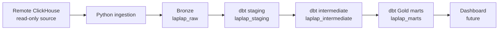
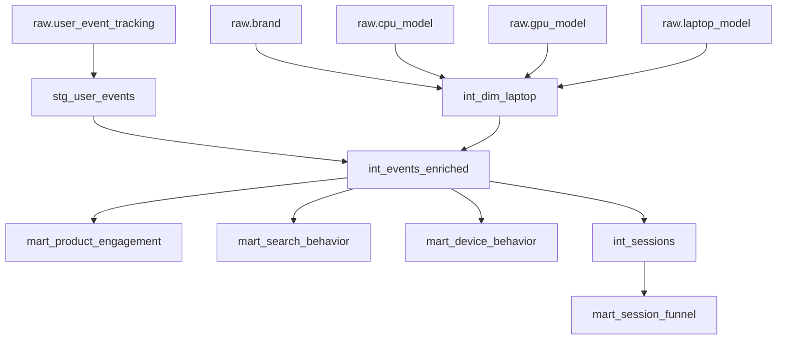

# LapLap Analytics

LapLap Analytics is a Data Engineering portfolio project for clickstream and
laptop-product analytics. It extracts from a read-only ClickHouse source into a
local ClickHouse warehouse, then builds reusable behavioral and product models
with dbt.

## Overview

The platform makes the laptop discovery journey measurable: discovery, search,
product interest, comparison selection, and comparison interaction. Source
data is never modified. Python owns local Bronze ingestion and dbt owns local
transformations.

## Architecture



The local ClickHouse instance runs through Docker Compose. `laplap_raw` is the
source-preserving Bronze layer; `laplap_staging`, `laplap_intermediate`, and
`laplap_marts` hold the dbt Silver, intermediate, and Gold layers.

## Tech Stack

- Python
- ClickHouse
- dbt Core and dbt-clickhouse
- Docker Compose
- pytest
- Git

DBeaver is useful for local exploration, but is not a runtime dependency.

## Source Data

The source contains clickstream events, laptop product master data, normalized
brand/CPU/GPU dimensions, and a laptop benchmark table. The remote ClickHouse
database is strictly read-only: ingestion issues `SELECT` statements only, and
all writes target local ClickHouse.

## Data Layers

### Bronze

`laplap_raw` preserves source columns and types. Each ingested row also records
`_ingested_at`, `_ingestion_batch_id`, and `_source_system` for auditability.

### Staging

Staging models normalize names, parse nullable JSON event/device payloads,
derive UTC timestamp fields, and expose stable analytical columns.

### Intermediate

- `int_dim_laptop` joins laptop, brand, CPU, and GPU master data.
- `int_events_enriched` preserves all events with a `LEFT JOIN` to product data,
  including orphan-reference flags.
- `int_sessions` creates session-level behavior and sequence-aware funnel stages.

### Gold

- `mart_product_engagement`
- `mart_search_behavior`
- `mart_device_behavior`
- `mart_session_funnel`

`laptop_benchmark_result` deliberately has no downstream model yet: its source
volume is too small to justify a speculative transformation.

## Sequence-Aware Session Funnel

Event participation and strict funnel completion answer different questions.
Participation records whether an action happened at any point in a session. The
strict funnel requires the ordered sequence:

```text
Search -> Product View -> Comparison Selection -> Add to Comparison
```

A session that selects a comparison without first searching and viewing a
product has comparison participation, but has not reached the comparison stage
of the strict funnel. `int_sessions` records the first valid timestamp at each
stage and exposes strict reached flags.

The deterministic development fixture covers a full funnel, dropout after
product view, an out-of-order comparison, and a search-only dropout. Its
development-only result is 4 sessions: 3 search, 2 product view, 1 comparison,
and 1 add. The derived rates are 75.00%, 66.67%, 50.00%, and 100.00%; these are
test-data checks, not production business metrics.

## Ingestion Strategy

Master tables use explicit full snapshots. Events use bounded keyset pagination:

```sql
WHERE id > last_id
  AND id <= high_watermark
ORDER BY id
LIMIT batch_size
```

This avoids `OFFSET`, permits ID gaps, and prevents an initial load from growing
while new events arrive. A resumed load uses the original high watermark and
the local maximum completed ID; it never captures a new watermark mid-run.

See [the ingestion strategy](docs/ingestion_strategy.md) and the
[full-load runbook](docs/full_load_runbook.md) before a real-source load.

## Reconciliation and Data Quality

Ingestion validates row counts, unique IDs, minimum/maximum IDs, deterministic
samples, and source-to-target columns. DateTime64 fields are reconciled as Unix
epoch milliseconds, so their absolute instants are independent of display or
server timezones.

## Timestamp Fidelity

An earlier Windows UTC+7 issue showed that a naive Python `datetime` could shift
a source DateTime64 value by seven hours during insertion. DateTime64 values are
now selected as Unix epoch milliseconds, restored as timezone-aware UTC Python
datetimes, and inserted into their original Bronze types. No manual hour offset
is used.

## Development Mode

dbt reads `laplap_raw` by default. To validate against deterministic local
development data instead, set the source schema for the current PowerShell
session:

```powershell
$env:DBT_RAW_SCHEMA = "laplap_dev_raw"
```

Remove the override before validating the real Bronze layer:

```powershell
Remove-Item Env:DBT_RAW_SCHEMA -ErrorAction SilentlyContinue
```

## Testing

From the repository root:

```powershell
python -m pytest -v
```

For the dbt development fixture:

```powershell
Push-Location dbt
$env:DBT_RAW_SCHEMA = "laplap_dev_raw"
..\.venv-dbt\Scripts\dbt.exe build --profiles-dir .
..\.venv-dbt\Scripts\dbt.exe docs generate --profiles-dir .
Pop-Location
```

## dbt Lineage



There is no committed lineage screenshot; the Mermaid graph is the maintained
lineage reference. `raw.laptop_benchmark_result` intentionally has no
downstream model.

## Current Status

Completed: local ClickHouse, Bronze schemas, ingestion framework,
reconciliation coverage, staging, intermediate models, the strict session
funnel, marts, Python tests, and dbt tests/docs generation.

Pending: a full real-source initial load, full-data profiling, orchestration,
observability, and a dashboard.

## Future Work

- Run and reconcile the bounded real-source initial load when the source is available.
- Add incremental ingestion with durable checkpoints.
- Add orchestration and operational observability.
- Build a dashboard on the Gold marts.

For architecture boundaries and transformation choices, see
[docs/architecture.md](docs/architecture.md).
