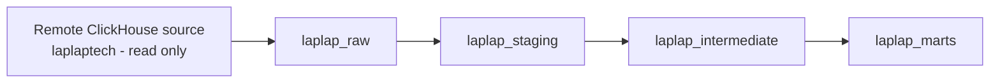

# LapLap Analytics

Clickstream and product-comparison analytics platform for a laptop discovery
experience. This repository currently provides a clean, secure, reproducible
local ClickHouse development environment only.

## Project overview

LapLap Analytics will turn remote product and clickstream data into trustworthy
analytics datasets. The remote ClickHouse source is read-only; the local
ClickHouse instance is the isolated workspace for future ingestion and
transformation phases.

## Business context

The user journey moves from device discovery to product interest, selecting
devices for comparison, adding them to a comparison, and interacting with
comparison charts. The future platform will make this funnel observable without
changing the source application database.

## Current dataset characteristics

- 766,134 clickstream events from 34,353 anonymous users and 86,390 sessions.
- Event range: 2025-01-15 through 2026-09-02.
- Event types include search, page views, loading more devices, comparison
  selection, comparison addition, chart sorting, login, and Geekbench version
  selection.
- `event_data` is nullable JSON with an evolving schema; its 569 known nulls
  belong to the business-valid `user_login` event.
- `device` is nullable JSON with stable device metadata keys.
- Laptop dimension joins are currently complete for brand, CPU, and GPU; four
  known event `device_id` values do not match `laptop_model`.
- `laptop_benchmark_result` currently has one row, so it is not a core source.

## Architecture



The local ClickHouse service, warehouse databases, and Bronze table schema are
implemented. No source data has been ingested by default.

## Repository structure

```text
laplap-analytics/
|- docker/                    # Reserved for Docker assets
|- ingestion/src/             # Safe connection and manual test-load utilities
|- sql/
|  |- ddl/                    # Idempotent local ClickHouse initialization
|  `- exploration/            # Read-only remote source discovery queries
|- docs/                      # Project and ingestion documentation
|- dashboards/                # Reserved for future dashboard assets
|- tests/                     # Reserved for future automated checks
|- airflow/                   # Reserved for a later orchestration phase
|- dbt/                       # Reserved for a later transformation phase
|- .env.example               # Credential-free environment variable template
|- .gitignore                 # Excludes secrets and local build artifacts
|- docker-compose.yml         # Local ClickHouse service definition
`- README.md
```

## Prerequisites

- Docker Desktop for Windows, running with Docker Compose v2.
- Optional: DBeaver with the ClickHouse driver.

## Setup

1. Keep `.env` untracked. Do not copy production credentials into this
   repository, source code, terminal output, or logs.
2. The Compose file has safe local defaults, so no `.env` file is required to
   start ClickHouse. When a local override is needed, create `.env` from
   `.env.example` and set only local connection values.
3. Run:

   ```powershell
   docker compose up -d
   docker compose ps
   docker compose logs clickhouse
   docker compose down
   ```

The service uses the pinned official image
`clickhouse/clickhouse-server:25.8.33.6`. A full version pin makes local
rebuilds reproducible and avoids unreviewed changes from `latest`. The official
image supports initialization scripts in `/docker-entrypoint-initdb.d`; this
project mounts `sql/ddl` there read-only. Those scripts run when the named
volume is first initialized, and the SQL itself is idempotent for safe manual
reruns.

## Health and connection

After `docker compose up -d`, check the service:

```powershell
Invoke-WebRequest http://localhost:8123/ping | Select-Object -ExpandProperty Content
```

Expected response: `Ok.`

In DBeaver, create a ClickHouse connection with:

- Host: `localhost`
- HTTP port: `8123`
- Native port: `9000`
- Database: `default`
- Username: `default`
- Password: blank, unless a local `.env` override supplies one

The initialized local databases are `laplap_raw`, `laplap_staging`,
`laplap_intermediate`, and `laplap_marts`.

Verify from DBeaver or a ClickHouse SQL console:

```sql
SELECT version();

SHOW DATABASES;
```

## Bronze / raw layer

`laplap_raw` contains empty, source-compatible Bronze tables for `brand`,
`cpu_model`, `gpu_model`, `laptop_model`, `laptop_benchmark_result`, and
`user_event_tracking`. Every table adds `_ingested_at`, `_ingestion_batch_id`,
and `_source_system` metadata.

For the next safe verification step, populate the required remote source
variables in an untracked `.env`, then run:

```powershell
pip install -r ingestion/requirements.txt
python -m ingestion.src.test_connections
```

These commands only test connectivity and run source `SELECT` statements. They
do not ingest events. See `docs/ingestion_strategy.md` before any manually
confirmed local test load.

If a development machine defines an HTTP proxy that should not handle the
remote ClickHouse request, the source client adds its configured host to the
process-local `NO_PROXY` list. It does not change system proxy settings.

## Security notes

- Never commit `.env`, database passwords, or other secrets.
- Treat remote `laplaptech` as read-only. Run only `SELECT` and `DESCRIBE`
  statements there; never test write access or create, alter, or drop objects.
- `sql/exploration/01_source_discovery.sql` is deliberately limited to
  read-only source discovery.
- The local Docker service is for development only. Do not expose it outside a
  trusted local environment.

## Roadmap

- Phase 1 - Source Discovery: DONE
- Phase 2 - Local Platform: DONE
- Phase 3A - Bronze / Raw Layer: CURRENT
- Phase 3B - Batch Ingestion
- Phase 4 - dbt Transformations
- Phase 5 - Analytics Marts
- Phase 6 - Airflow Orchestration
- Phase 7 - Streaming / Redpanda
- Phase 8 - BI / Monitoring / Optimization
