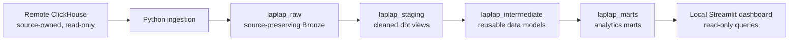

# Architecture

LapLap Analytics separates source ownership from local analytical ownership.
The remote ClickHouse database is owned by the source application and is
read-only to this project. Local ClickHouse is the only write target.

Python takes explicit master snapshots and performs a manually confirmed,
bounded initial event load with keyset pagination. It records batch metadata and
reconciles source and local data while retaining DateTime64 values as absolute
UTC instants.

dbt parses semi-structured event data in staging, joins normalized product
dimensions in intermediate models, and publishes product, search, device, and
funnel marts. Product enrichment uses a `LEFT JOIN` so events with unknown or
orphan laptop references remain visible.

Some source CPU/GPU records lack a brand relationship. Bronze preserves those
`NULL` values, and `int_master_data_quality` reports active, laptop-referenced
missing relationships as warning rows. The pipeline does not infer a component
brand from the laptop brand, and affected laptops remain in the dimension.

The dashboard reads local warehouse tables only. It presents the Gold marts
alongside session and ingestion-quality context, without querying or writing to
the remote source.

The session funnel keeps two concepts separate: participation means an event
occurred; strict completion means that the event happened after the previous
stage. This preserves the ordered sequence from search through comparison add,
and avoids classifying an out-of-order comparison action as funnel progress.
